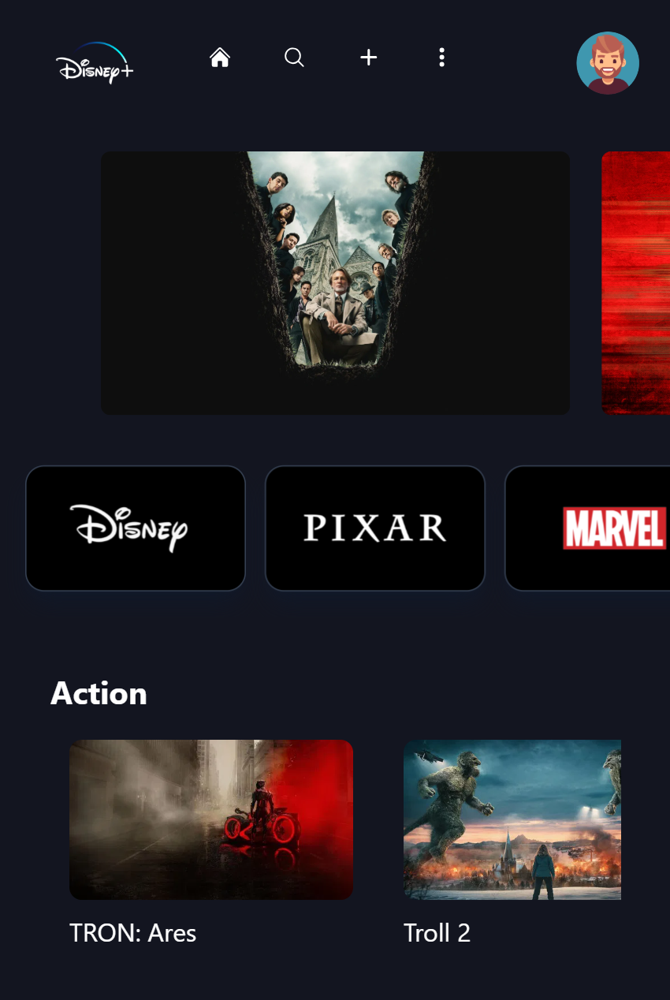
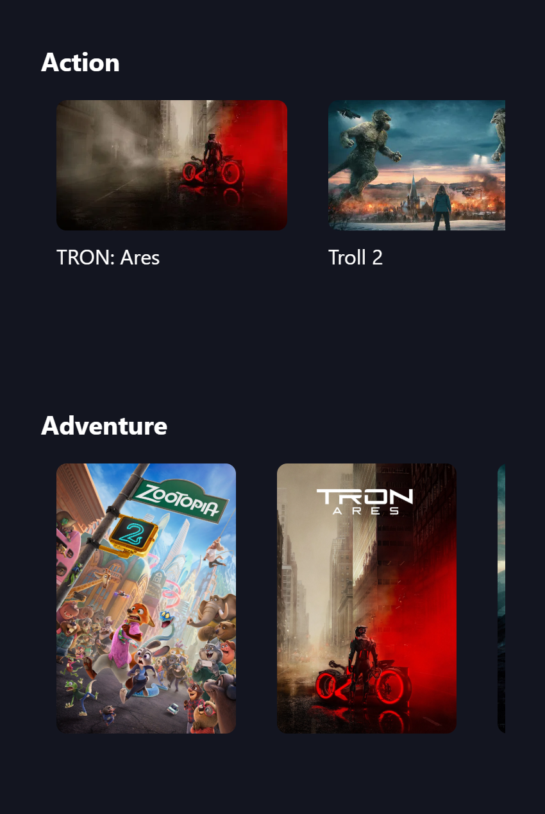
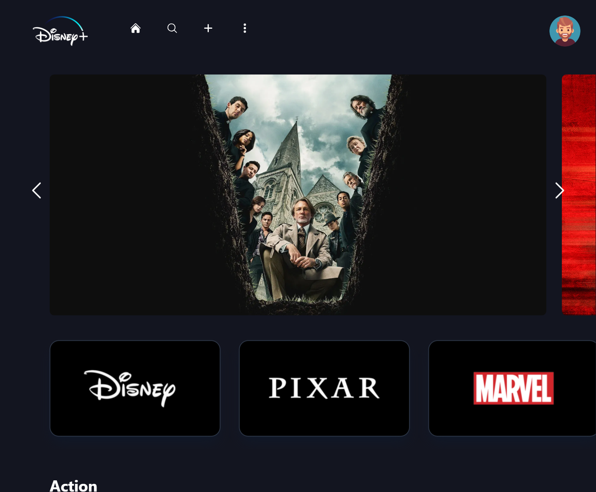
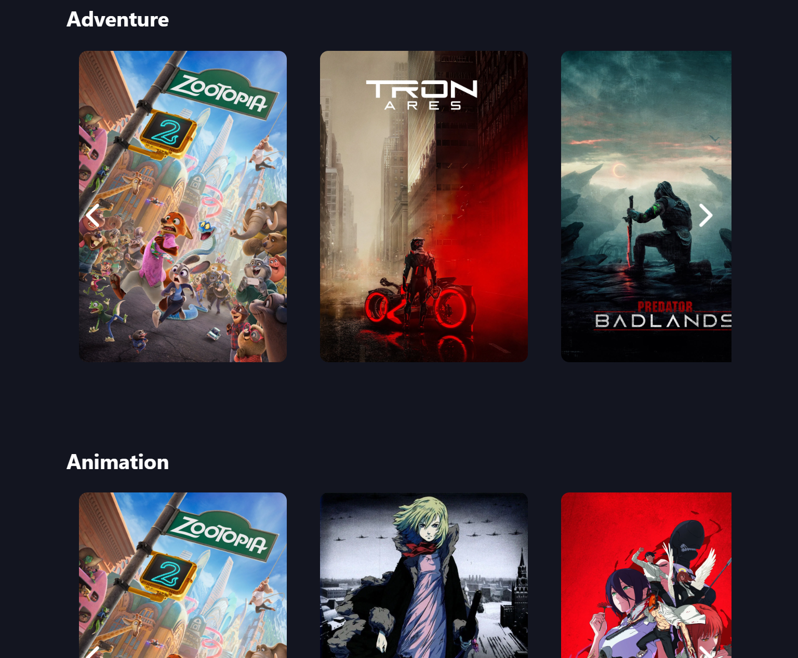
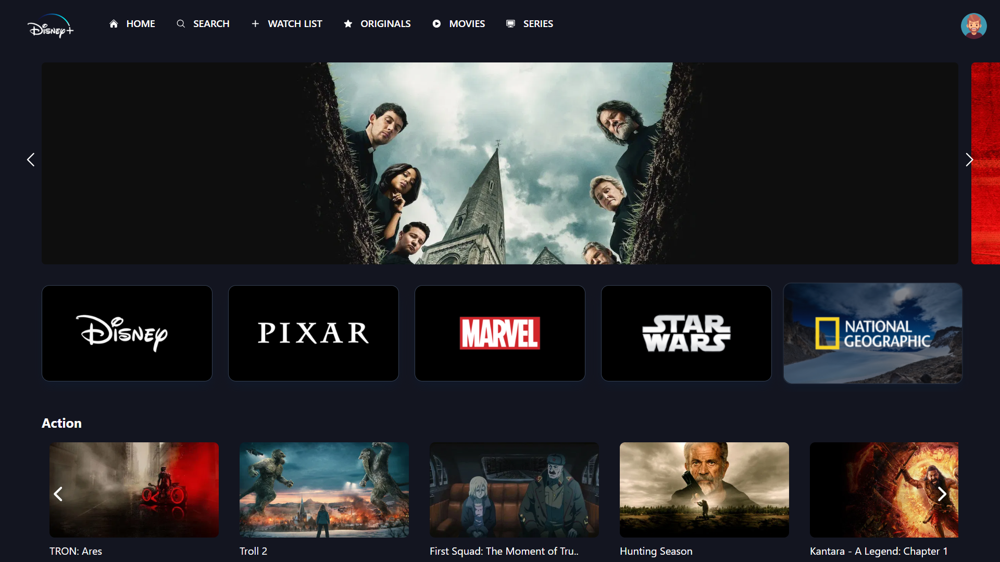
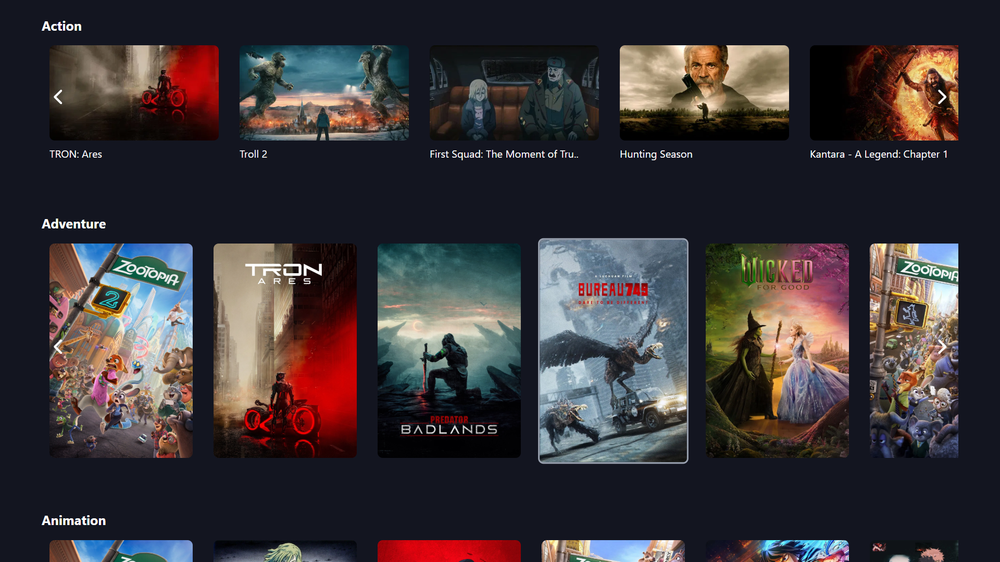

# 🎬 Disney+ Home Page Clone

A modern and responsive **Disney+ home page clone** built using **React JS** ⚛️ and **Tailwind CSS** 🎨, powered by the **TMDB API** 🎥.  
This project replicates the look and feel of **Disney+** ✨ with dynamic movie rows 🍿, genre-based sections 🎭, and a smooth UI experience 🚀.

## 🔗 Live Preview

🌐 **Live Demo:** https://disney-clone-blond-sigma.vercel.app/

## 🎨 Screenshots

| 📱 **Small Device** | 🌟 **Slider** |
|---|---|
|  |  |

|  🔳 **Medium Device** | 🌟 **Slider** |
|---|---|
|  |  |

|  💻 **large Device** | 🌟 **Slider** |
|---|---|
|  |  |


## ✨ Features

<div align="center">
  <table>
    <tr>
      <td align="center" width="33%">
        <div><b>📱 Responsive UI</b></div>
        <div>Perfect on all devices</div>
      </td>
      <td align="center" width="33%">
        <div><b>🎥 Dynamic Content</b></div>
        <div>Real TMDB data</div>
      </td>
      <td align="center" width="33%">
        <div><b>🎠 Genre Carousels</b></div>
        <div>Action, Comedy, Sci-Fi & more</div>
      </td>
    </tr>
    <tr>
      <td align="center" width="33%">
        <div><b>⚡ Trending Slider</b></div>
        <div>Full-width hero section</div>
      </td>
      <td align="center" width="33%">
        <div><b>🏢 Studio Logos</b></div>
        <div>Disney, Pixar, Marvel</div>
      </td>
      <td align="center" width="33%">
        <div><b>🎨 Tailwind CSS</b></div>
        <div>Modern styling</div>
      </td>
    </tr>
  </table>
</div>

## 🛠 Tech Stack

- ⚛️ React JS – Component-based UI development  
- 🎨 Tailwind CSS – Utility-first styling for responsive design  
- 🎬 TMDB API – Movie and TV show data provider  
- 🌐 Axios / Fetch API – For API requests  
- ⚡ Vite – Fast development and build tool  
- 🧩 JavaScript (ES6+) – Modern JavaScript features

## 📂 Project Setup

```bash
git clone https://github.com/your-username/disney-clone.git
cd disney-clone
npm install
npm run dev
```
